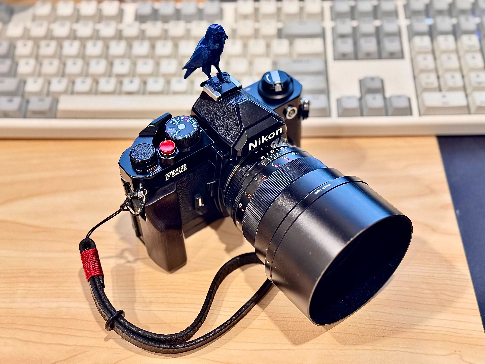

# Friends

*Friends* is an American sitcom that ran on NBC from September 22, 1994 to May 6, 2004. Across 10 seasons and 236 episodes, it followed six friends navigating work, love, and life in Manhattan. It became one of the most popular and influential TV shows ever made.

its also my fav show. 

## The premise

Six friends in their 20s and 30s live near each other in New York City. They hang out at their apartments and at Central Perk, a neighborhood coffee house. The show mixes romance, career struggles, and everyday comedy.

## The six main characters

- **Rachel Green** (Jennifer Aniston): Starts as a runaway bride, grows from spoiled to independent. On-and-off love story with Ross.
- **Ross Geller** (David Schwimmer): Paleontologist, Monica’s older brother. Divorced three times. “We were on a break.”
- **Monica Geller** (Courteney Cox): Competitive chef and clean freak. Ends up with Chandler.
- **Chandler Bing** (Matthew Perry): Sarcastic office worker with the best one-liners. Marries Monica.
- **Joey Tribbiani** (Matt LeBlanc): Struggling actor and loyal friend. “How you doin’?”
- **Phoebe Buffay** (Lisa Kudrow): Quirky masseuse and musician. Sings “Smelly Cat.”

## Why it worked

- **Ensemble chemistry:** All six leads got equal focus and eventually equal pay.
- **Central Perk:** The orange couch became an icon.
- **Catchphrases:** “How you doin’?”, “We were on a break”, “Smelly Cat”.
- **Theme song:** “I’ll Be There for You” by The Rembrandts.
- **Relatable stakes:** Jobs, dating, and friendship over big drama.

## Legacy

- Won multiple Emmy and Golden Globe awards.
- Finale drew over 52 million U.S. viewers in 2004.
- Found a huge new audience through streaming decades later.
- A reunion special, *Friends: The Reunion*, aired in 2021.
- Checking if editing lists land as conflicts again
- let me try editing lists again
- Creating a new bullet point to watch for conflicts again
- testing again?
- Creating multiple changes at once 
- New changes here too

## Central Perk 

Central Perk Cafe is **the iconic, fictional coffee shop from the beloved 90s sitcom *Friends***. Thanks to the show's enduring popularity, several real-life cafes and official experiences have been built across the US so fans can step right into the gang's favorite hangout.

## Joey Tribbiani

Joey Tribbiani, played by Matt LeBlanc on *Friends*, is a lovable, struggling actor known for his dim-witted but charming innocence, his deep love of food, and his iconic catchphrase, "How you doin'?". **Beneath his ladies' man persona lies a fiercely loyal friend who always supports his group**.

## TLDR

*Friends* (NBC, 1994 to 2004) is a 10-season sitcom about six friends in New York. Fueled by strong cast chemistry, sharp writing, and the Central Perk hangout, it became a cultural landmark that still draws fans today. why did it creates a conflict now. testing the doc again?

Let me now add a new image to this document. im chceking the round trip imports edits again

## Disco Trend Falconer logo

Lets create another review request and let the reviewer swap an image this time. making edits on github now.

