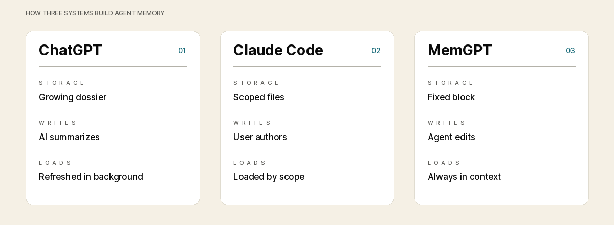

# Images Test

Adding a new image. Testing that edits from github prerserve the image in Falconer. We will try this agin. lets see if images are preserved when doc isnt open? this feat is going to be the end of me

Edits. Testing references and push gate here [Permissions](Permissions.md)

Refering a falconer doc that is synced to this repo: [Permissions](Permissions.md) 

Referencing a doc that isn't: [test](http://localhost:3000/editor/pmn3yxje2bpf2ajz9yqc35w4__test)

Non doc reference: appy 

Relative links via GitHub: [Friends](https://github.com/apoorvas20/test-repo-1/blob/main/Freinds.md)

Also including an external link here: [Embedding model](https://github.com/AryamanAgrawal/memory-management/blob/main/docs/EMBEDDING_MODEL_PROPOSAL.md)

